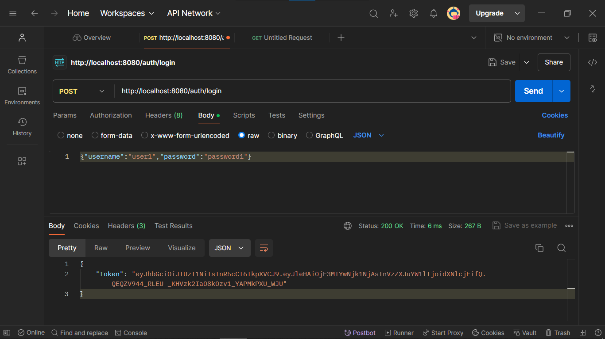
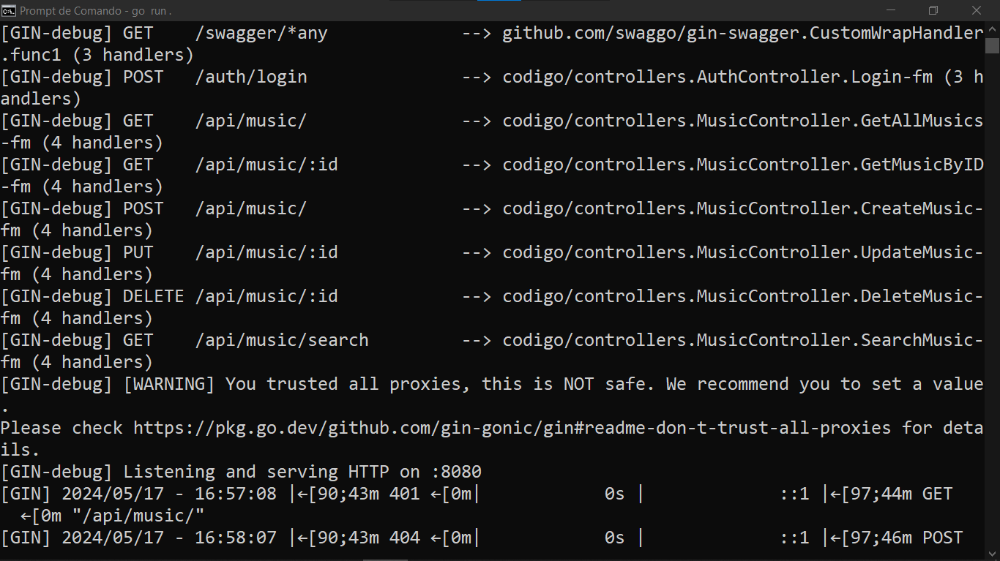

# API RESTFUL DE MUSICAS
👨‍💻API RESTFUL COM OPERAÇÕES CRUD DE MUSICAS COM O FRAMEWORK GIN DO GOLANG!

 <br>
 <br>

## DESCRIÇÃO:
Este novo projeto é uma API RESTful desenvolvida em Go utilizando o framework Gin, que permite gerenciar uma coleção de músicas. Além das operações CRUD básicas (Create, Read, Update, Delete), esta API inclui funcionalidades avançadas como busca por título ou artista, paginação e autenticação JWT (JSON Web Token).

## FUNCIONALIDADES:
1. **Listar todas as músicas**: Recupera uma lista de todas as músicas cadastradas, com suporte a paginação.
2. **Obter uma música pelo ID**: Recupera as informações de uma música específica através do seu ID.
3. **Criar uma nova música**: Adiciona uma nova música à coleção.
4. **Atualizar uma música existente**: Atualiza as informações de uma música existente na coleção.
5. **Deletar uma música**: Remove uma música específica da coleção.
6. **Buscar músicas por título ou artista**: Permite buscar músicas com base no título ou no artista.
7. **Autenticação JWT**: Protege as rotas de criação, atualização e exclusão de músicas.

## EXECUTANDO O PROJETO:
1. **Iniciar o Servidor**
   - Para iniciar o servidor, execute o arquivo em `./CODIGO/main.go` com um dos seguintes comandos no terminal:

   ```bash
   go run .
   ```

   ou
   ```bash
   go run main.go
   ```

2. **Testar a API**
   - Use ferramentas como Postman ou cURL para testar os endpoints.

   **Autenticação**
   ```bash
   curl -X POST http://localhost:8080/auth/login -d '{"username":"user1","password":"password1"}' -H "Content-Type: application/json"
   ```

   **Listar todas as músicas (com token JWT)**
   ```bash
   curl -X GET http://localhost:8080/api/music/ -H "Authorization: Bearer <your_token>"
   ```

   **Obter uma música pelo ID (com token JWT)**
   ```bash
   curl -X GET http://localhost:8080/api/music/1 -H "Authorization: Bearer <your_token>"
   ```

   **Criar uma nova música (com token JWT)**
   ```bash
   curl -X POST http://localhost:8080/api/music/ -d '{"title":"New Song","artist":"New Artist","album":"New Album","year":2024}' -H "Content-Type: application/json" -H "Authorization: Bearer <your_token>"
   ```

   **Atualizar uma música existente (com token JWT)**
   ```bash
   curl -X PUT http://localhost:8080/api/music/1 -d '{"title":"Updated Song","artist":"Updated Artist","album":"Updated Album","year":2024}' -H "Content-Type: application/json" -H "Authorization: Bearer <your_token>"
   ```

   **Deletar uma música (com token JWT)**
   ```bash
   curl -X DELETE http://localhost:8080/api/music/1 -H "Authorization: Bearer <your_token>"
   ```

   **Buscar músicas por título ou artista (com token JWT)**
   ```bash
   curl -X GET http://localhost:8080/api/music/search?title=Bohemian -H "Authorization: Bearer <your_token>"
   ```

   **Documentação Swagger**
   - Acesse a documentação Swagger em [http://localhost:8080/swagger/index.html](http://localhost:8080/swagger/index.html)

3. **Usando o Postman:**
   Para testar a API RESTful de músicas usando o Postman, siga os passos abaixo. Certifique-se de que o servidor está rodando e que você já possui o token JWT gerado pelo endpoint de login.

   1. **Configurar o Ambiente no Postman:**

      - Abra o Postman e crie uma nova coleção (Collection) para organizar suas requisições.
      - Crie um novo ambiente (Environment) e adicione uma variável chamada `token` com o valor do token gerado ao fazer o login.

   2. **Adicionar o Token JWT nas Requisições:**

      Para cada requisição que precisa de autenticação, você deve adicionar o cabeçalho `Authorization` com o valor `Bearer <seu_token>`. Você pode utilizar a variável do ambiente para facilitar este processo.

      No campo de cabeçalhos, adicione:
      ```
      Authorization: Bearer {{token}}
      ```

   3. **Testar os Endpoints da API:**

       1. **Listar todas as músicas**
      - **Método:** `GET`
      - **URL:** `http://localhost:8080/api/music/`
      - **Headers:**
      ```
      Authorization: Bearer {{token}}
      ```

      2. **Obter uma música pelo ID**
      - **Método:** `GET`
      - **URL:** `http://localhost:8080/api/music/:id`
      - **Headers:**
      ```
      Authorization: Bearer {{token}}
      ```
      - **Exemplo:** `http://localhost:8080/api/music/1`

      3. **Criar uma nova música**
      - **Método:** `POST`
      - **URL:** `http://localhost:8080/api/music/`
      - **Headers:**
      ```
      Authorization: Bearer {{token}}
      Content-Type: application/json
      ```
      - **Body (raw, JSON):**
      ```json
      {
            "title": "New Song",
            "artist": "New Artist",
            "album": "New Album",
            "year": 2024
      }
      ```

      4. **Atualizar uma música existente:**
      - **Método:** `PUT`
      - **URL:** `http://localhost:8080/api/music/:id`
      - **Headers:**
      ```
      Authorization: Bearer {{token}}
      Content-Type: application/json
      ```
      - **Body (raw, JSON):**
      ```json
      {
            "title": "Updated Song",
            "artist": "Updated Artist",
            "album": "Updated Album",
            "year": 2024
      }
      ```

      5. **Deletar uma música**
      - **Método:** `DELETE`
      - **URL:** `http://localhost:8080/api/music/:id`
      - **Headers:**
      ```
      Authorization: Bearer {{token}}
      ```
      - **Exemplo:** `http://localhost:8080/api/music/1`

      6. **Buscar músicas por título ou artista**
      - **Método:** `GET`
      - **URL:** `http://localhost:8080/api/music/search?title=Bohemian`
      - **Headers:**
      ```
      Authorization: Bearer {{token}}
      ```

   4. **Exemplo de Requisição no Postman**

      1. **Listar todas as músicas**

         1. Selecione o método `GET`.
         2. Insira a URL `http://localhost:8080/api/music/`.
         3. Adicione o cabeçalho `Authorization` com o valor `Bearer {{token}}`.
         4. Clique em `Send`.

      2. **Criar uma nova música**

         1. Selecione o método `POST`.
         2. Insira a URL `http://localhost:8080/api/music/`.
         3. Adicione os cabeçalhos:
            ```
            Authorization: Bearer {{token}}
            Content-Type: application/json
            ```
         4. No corpo da requisição, selecione `raw` e `JSON`, e insira o JSON da nova música:
            ```json
            {
               "title": "New Song",
               "artist": "New Artist",
               "album": "New Album",
               "year": 2024
            }
            ```
         5. Clique em `Send`.

   Repita esses passos para cada endpoint que você deseja testar, ajustando o método, a URL, os cabeçalhos e o corpo conforme necessário.

   Dessa forma, você conseguirá testar todas as funcionalidades da API RESTful de músicas diretamente no Postman utilizando o token JWT para autenticação.

## NÃO SABE?
- Entendemos que para manipular arquivos em muitas linguagens e tecnologias, é necessário possuir conhecimento nessas áreas. Para auxiliar nesse aprendizado, oferecemos alguns subsidios:
* [CURSO DE GIN](https://github.com/VILHALVA/CURSO-DE-GIN)
* [CONFIRA MAIS CURSOS](https://github.com/VILHALVA?tab=repositories&q=+topic:CURSO)

## CREDITOS:
- [PROJETO CRIADO PELO VILHALVA](https://github.com/VILHALVA)

